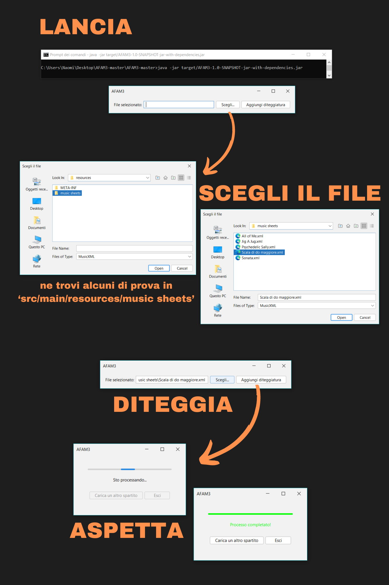
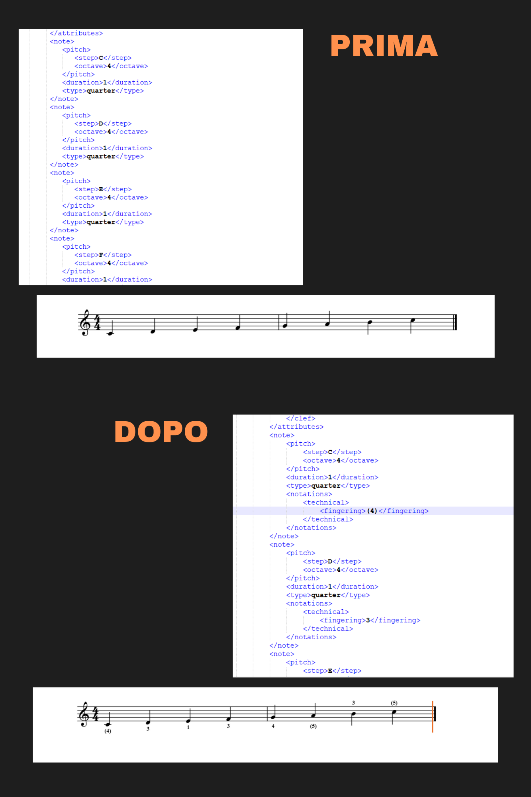

# AFAM 3

AFAM3 sta per Automatic Fingering for Accordion in Minor Thirds. È un'applicazione desktop interamente scritta in Java, il cui obiettivo è diteggiare spartiti in formato MusicXML per fisarmonica a bottoni in terze minori. Il risultato è stato ottenuto tramite un algoritmo di intelligenza artificiale.

## Limitazioni

Al momento l'applicazione diteggia solo il manuale destro e lavora solo su spartiti monodici in do maggiore e in chiave di violino.

## Prerequisiti

- JDK versione 13
- Apache Maven

## Installazione

Entra nella directory del progetto:

```shell
cd path-progetto
```

Compila il progetto con Maven:

```shell
mvn package
```

Esegui il JAR generato nella directory `target`:

```shell
java -jar target/AFAM3-1.0-SNAPSHOT-jar-with-dependencies.jar
```

## Uso

Per visualizzare gli spartiti prima e dopo l'esecuzione, si consiglia un tool esterno in grado di leggere il formato MusicXML. A [questo link](https://www.soundslice.com/musicxml-viewer/) si può trovare un viewer gratuito online. 

Nella directory del progetto è presente la cartella `src/main/resources/music sheets`, nella quale sono stati caricati alcuni spartiti d'esempio su cui provare l'applicazione.

Al lancio, l'applicazione mostra una finestra di dialogo da cui è possibile scegliere lo spartito in formato MusicXML da diteggiare. Cliccando sull'apposito pulsante, basterà attendere il completamento dell'operazione notificato dall'interfaccia.

Si possono verificare i risultati aprendo direttamente il file MusicXML modificato (la diteggiatura viene annotata negli elementi `<fingering>`) o visualizzandolo nel viewer di cui sopra.  




